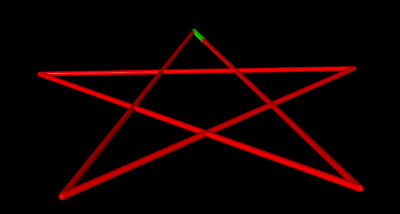
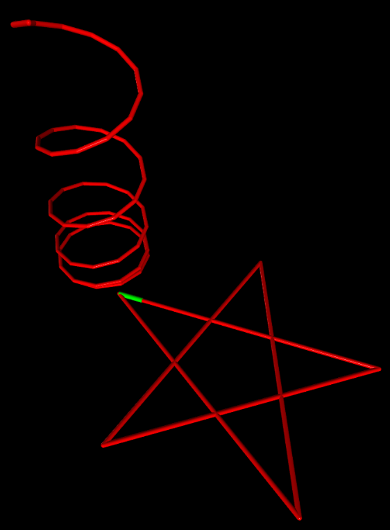
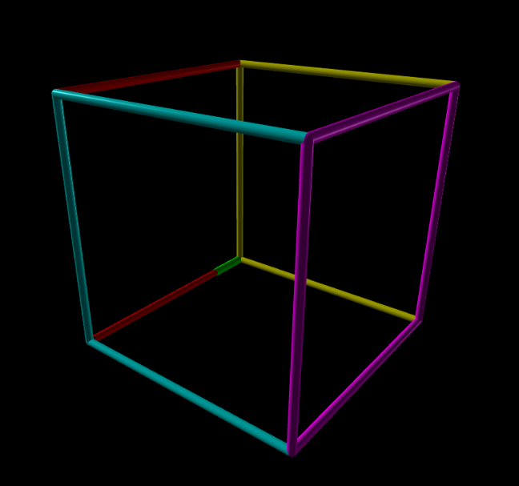

# **LP Python Project "Logo3D"**

This project was developed for the 'Programming Languages' (LP) course at FIB in 2020-21 Q2

## **Background**

Logo3D is a 3D variant of the Logo programming language which consists in drawing shapes by giving directions to a turtle which serves as a brush.



## **Objective**

The project consists in developing an interpreter in python for Logo3D. Using `ANTLR`, for interpreting the grammar and building the AST (Abstract Syntax Tree), and `vpython` for handling the graphics.

## **Implementation**

The implementation can be divided into:

1) [Grammar](#grammar)
2) [AST Visitor](#ast-visitor)
3) [Turtle3D class](#turtle3d-class)

## **Grammar**

First, the core rules for the logic of the language are defined below:

```antlr

root : (function)+ EOF;

function : 'PROC' ID funcParam 'IS' instrucBloc 'END';

funcParam: '('(ID (','ID)*)?')'; 

instrucBloc : instruc+ ;

instruc : assignationInst | writeInst | readInst | ifInst | whileInst | forInst | callInst;
```

The rules of the types of possible instructions are defined as well. It is worth noting that the grammar in this section does not contain the turtle's integration yet (See the section that deals with the [turtle's integration](#grammar-integration) to observe the necessary changes made to offer said support).

```antlr
ifInst : 'IF' expr 'THEN'  instrucBloc ('ELSE' instrucBloc)? 'END';

whileInst : 'WHILE' expr 'DO'  instrucBloc 'END';

forInst : 'FOR' ID 'FROM' expr 'TO' expr 'DO' instrucBloc 'END';


writeInst : '<<' expr;

readInst : '>>' ID;

callInst : ID '('(expr (','expr)*)?')'; 

assignationInst : ID ASSIGN expr;

expr : '(' expr ')'     # parenthesizedExpr
    | expr EQ expr      # equalExpr
    | expr NEQ expr     # differentExpr
    | expr LE expr      # lessExpr
    | expr GT expr      # greaterExpr
    | expr LEQ expr     # lessEqualExpr
    | expr GEQ expr     # greaterEqualExpr
    | expr MUL expr     # mulExpr
    | expr DIV expr     # divExpr
    | expr MES expr     # mesExpr
    | expr MENYS expr   # menyslExpr
    | REAL              # realExpr
    | INT               # intExpr
    | ID                # varExpr
    ;
```

And finally the atoms of the language are defined:

```antlr
ID : [a-z][a-zA-Z0-9_]*;    
REAL : [0-9]+'.'[0-9]*;
INT : ('-')?[0-9]+ ;
ASSIGN : ':=';
EQ : '==';
NEQ : '!=';
LE : '<';
GT : '>';
LEQ : '<=';
GEQ : '>=';
MES : '+' ;
MENYS : '-' ;
MUL : '*' ;
DIV : '/' ;
WS : [ \t\r\n]+ -> skip ;
COMMENT : '//'~'\n'* -> skip;
```

## **AST Visitor**

The visitor handles all the logic that has to be applied to the AST. Below we can observe an example of how most of the methods handle the interaction with the AST generated.

### **Example Method**

```python
#formatted code with autopep8....

# Visit a parse tree produced by logo3dParser#callInst.
    def visitCallInst(self, ctx: logo3dParser.CallInstContext):
        #print("Visiting Call Instruction")
        l = list(ctx.getChildren())
        functionName = l[0].getText()
        paramValues = [self.visit(l[i]) for i in range(
            2, len(l)-1) if l[i].getText() != ',']
        if(functionName in self.functDic):
            # print(functionName)
            instBlock = self.functDic[functionName]
            param = instBlock[0]
            block = instBlock[1]
            paramVars = self.visit(param)
            bindingsDic = {}
            bindingsDic = self.bindVariablesWithValues(
                paramVars, paramValues, functionName)
            # print(bindingsDic)
            self.contextPush(bindingsDic)
            #print("Entering function")
            self.visit(block)
            #print("Exiting function")
            self.contextPop()
        else:
            errorMsg = "Error, there is no function with name '{}'"
            raise Exception(errorMsg.format(functionName))
```

As seen above `visitCallInst` handles the rule `callInst` in the grammar. The method follows the procedure described, in a high-level manner, down below:

1. Gets all the parts in the context (tokens like ID, parethesis, none or several expressions, etc.).
2. Checks if the procedure exists and if true, continues, otherwise throws an error and the program exits.
3. Gets the block of instructions of said procedure.
4. Tries to bind the parameters' values with the function's symbols. At fail throws an error and the program exits.
5. Changes the context (saves the current context and creates a new one with proper variables).
6. Executes the instructions block of the procedure (if an error is thrown, the program exits).
7. Restores context (erases the previous context and retrieves the original context).

The rest of the methods in the visitor follow a more or less similar approach to tackle their respective rules.

It should be pointed out as well that this exact procedure is modified later on at [visitor interaction](#visitor-interaction) section in order to support the Turtle3D API.

### **Error Support**

The supported errors in this project are the following:

- ***Zero division***: throws an error at expression evaluation when the divisor evaluates to zero.
- ***Undefined procedure call***: throws an error when calling an instruction that does not exists.
- ***Already defined procedure***: throws an error when a two procedures have the same ID at traversing the root of the tree (when obtaining the program procedures).
- ***Incorrect number of parameters***: throws an error when trying to bind a different quantity  of parameters' values with the function's symbols.
- ***Repeated symbols in function's signature***: throws an error when there are two parameters with the same symbol within the method's signature at traversing the root of the tree.
- ***Input contains letters***: throws an error when reading input from console or trying to parse an argument from the console and is not formatted as an Integer or Float.

## **Turtle3D class**

This class serves as an interface for the `vpython` library and is called from within the `Visitor` class to add the necessary behaviour for drawing on screen.

The following sections describe its structure and its integration with the base [grammar](#grammar) and [visitor](#ast-visitor).

### **Class Description**

All the methods within this class are described below divided in public and private categories.

#### **Public Methods**

All the methods in this section comprise the turtle's API callable form any external entity.

- `__init__()`: The constructor of this class initializes all the [variables](#public-variables) described down below.
- `setupScene()`:  Initializes a default scene and draws the turtle on screen.
- `isSceneActive()`: Returns a bool indicating if `setupScene` has already been called.
- `forward(distance)`: Draws the turtle moving at the given distance in the current direction.
- `backward(distance)`: Draws the turtle moving at the given distance opposite to current direction.
- `left(deg)`: Changes the turtle's yaw negatively by `deg` degrees.
- `right(deg)`: Changes the turtle's yaw positively by `deg` degrees.
- `up(deg)`: Changes the turtle's pitch positively by `deg` degrees.
- `down(deg)`: Changes the turtle's pitch negatively by `deg` degrees.
- `color(r,g,b)`: Changes the color of the turtle's brush (trail drawn while moving).
- `hide()`: Activates the turtle's ability to leave a trail while moving.
- `show()`: Deactivates the turtle's ability to leave a trail while moving.
- `home()`: Resets the turtle's position to the coordinates' origin and facing positively along the x axis.

#### **Private Methods**

All the methods in this section comprise the turtle's APIs internal(auxiliary) methods in order for it to function properly.

- `_getDirection()`: Calculates the turtle's direction according to the current pitch and yaw values.
- `_draw(distance)`: Draws the turtle and its trail by calculating a point in the current direction at the given distance.

All the variables of the class are described below divided in public and private categories.

#### **Public Variables**

The only public variable in the API which can be changed at any moment on the fly without causing odd behaviors.

- `trailWidth`: Describes the width of the objects drawn which represent the trail of the turtle.
  
#### **Private Variables**

All the private variables which could possibly cause weird problems if changed externally.

- `_activeScene`: Boolean which describes if `setupScene()` has already been called.  
- `_yaw`: Float which describes the angle of the turtle in its XZ plane.  
- `_pitch`: Float which describes the angle of the turtle in its YZ plane.  
- `_turtle`: 3D Object in the scene symbolizing the turtle.
- `_currentPaintingColor`: 3D vector symbolizing the color of the turtle's brush.  
- `_homePosition`: 3D vector positioned at coordinates (0,0,0) representing the turtle's initial position.
- `_homeOrientation`: 3D vector with direction (1,0,0) representing the turtle's initial direction.
- `_canDraw`: Boolean which describes if the turtle leaves trail or not.  

### **Grammar Integration**  

In order to integrate the turtle's API, a modification in the rule in charge of calling instructions had to be made. Instead of expecting only an ID, it can expect for a `turtleCall` as well.

```antlr
callInst : (turtleCall|ID) '('(expr (','expr)*)?')'; 
```

The `turtleCall` rule is just a set of reserved words (atoms) describing the callable methods inside Turtle3D class.

```antlr
turtleCall : 'up' | 'down' | 'left' | 'right' | 'forward' | 'backward' | 'color' | 'hide' | 'show' | 'home';
```

### **Visitor Interaction**

In this section, the changes made in the visitor in order to handle correctly the grammar described before ([Grammar Integration](#grammar-integration)) are reviewed.

In the code snippet down below, one can appreciate the method in charge of handling the `callInst` rule of the grammar within the visitor (Non relevant code is summarized as `# ...`).  

One can see that after obtaining the function's name and its pameters' values, verifies if there is a variable of type `turtleCall` within the call context and, if true, sets up the scene (if necessary) and handles the call. Otherwise continues the procedure normally.

```python
    # Visit a parse tree produced by logo3dParser#callInst.
    def visitCallInst(self, ctx: logo3dParser.CallInstContext):
        #print("Visiting Call Instruction")
        l = list(ctx.getChildren())
        functionName = l[0].getText()
        paramValues = [self.visit(l[i]) for i in range(
            2, len(l)-1) if l[i].getText() != ',']
        isTurtleCall = (ctx.turtleCall() != None)
        if isTurtleCall:
            if not self.turtle.isSceneActive():
                print("setting up the scene...")
                self.turtle.setupScene()
            self.treatTurtleCall(functionName, paramValues)

        elif(functionName in self.functDic):
            # ...
        else:
            # ...
```

Taking into account that is indeed a valid call to the API, the respective function is obtained from the class by using `getattr(self.turtle, functionName)`. After that, the parameters symbols are obtained from the function's signature and validates that there are a number of parsed parameters equal to the number of obtained symbols. If true, it simply passes the parameters' values to the obtained function, otherwise raises an error.

```python
# Given a valid turtle function name and its parameters calls the corresponding function in Turtle3D API
    def treatTurtleCall(self, functionName, paramValues):
        myfunc = getattr(self.turtle, functionName)
        funcSignature = signature(myfunc)
        funcNumParam = len(funcSignature.parameters)
        if funcNumParam == len(paramValues):
            #print("Valid call")
            myfunc(*paramValues)
        else:
            errorMsg = "Wrong number of parameters calling function '{}'"
            raise Exception(errorMsg.format(functionName))

```

## **Main script**

The `logod.py` script is only in charge of correctly parsing the console arguments, obtaining the AST and passing the necessary arguments to the `visitor.py`.

## **Installation**

---------------

This project only needs two external libraries to work:

- `vpython` for the 3D graphics.

```powershell
  > pip3 install vpython --upgrade
```

- `ANTLR` for the grammar and the interpreter.
  
```powershell
  > pip3 install antlr4-python3-runtime  
```

Or install the necesary dependencies from the `requirements.txt` file. This can be done with pip:

```powershell
  > pip3 install -r requirements.txt
```

It is worth noting that the `requirements.txt` file contains a copy of all the libraries currently installed within the testing enviroment, so probably not all the libraries are necessary but are attached anyway just in case.

Additionally it is necessary to have a [java](www.java.com/download/manual.jsp) enviroment in order to generate the parser and lexer files.

Finally, proceed to download [antlr-4.9.2-complete.jar]([www.antlr.com](https://www.antlr.org/download/)) and execute the following command within the directory of the project:

```powershell
  > .\antlr-4.9.2-complete.jar -Dlanguage=Python3 -no-listener -visitor .\logo3d.g
```

This will generate the necessary files for the program to execute.

## **Usage**

---------------

In windows execute the main script sending a program as an argument.

```powershell
> python.exe .\logo3d.py .\logoProgram.l3d  
```

One also can execute functions individually by sending the program, the name of the function and its parameters as arguments.

```powershell
> python.exe .\logo3d.py .\logoProgram.l3d  fooName var1 var2
```

Although all the commands where executed in a windows console (powershell) they shouldn't differ much from a linux enviroment.

Examples of logo3D programs and their output can be appreciated down below:

***Spiral and Star***



```text
PROC cercle(mida, costats) IS
    FOR i FROM 1 TO costats DO
        forward(mida)
        left(360 / costats)
    END
END

PROC espiral(cercles) IS
    IF cercles > 0 THEN
        cercle(1, 12)
        up(5)
        espiral(cercles - 1)
    END
END

PROC star() IS
    FOR i FROM 1 TO 5 DO
        forward(10)
        right(144)
    END 
END

PROC main() IS
    espiral(5)
    home()
    star()
END
```

***Cube***



An overly complicated cube implementation in Logo3D to display most of the language capabilities

```text

PROC square(edgeSize) IS
    FOR i FROM 1 TO 4 DO
        forward(edgeSize)
        up(90)
    END
    up(90)
END

PROC cube(edgeSize) IS
    square(edgeSize)
    right(90)
    color(1,1,0)
    square(edgeSize)
    
    diag :=  2*edgeSize*edgeSize

    // calculating square root by divisions
    sqrt := diag / 2
    temp := sqrt
    sqrt := (temp + (diag / temp)) / 2
    WHILE ((temp - sqrt) != 0) DO
        temp := sqrt
        sqrt := (temp + (diag / temp)) / 2
    END
    hide()
    right(45)
    forward(sqrt)
    right(135)
    show()
    down(90)
    color(0,1,1)
    square(edgeSize)
    right(90)
    down(90)
    color(1,0,1)
    square(edgeSize)

    home()
END

PROC main() IS
    >> edgeSize
    cube(edgeSize)
    << edgeSize
END
```
